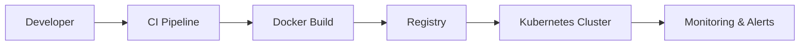

### Infrastructure Lead | Cloud & DevOps Engineer

Infrastructure Engineer with experience in hybrid environments (on-premise and cloud), specialized in Kubernetes, automation with Terraform, and CI/CD pipeline implementation.  
Focused on high availability, operational resilience, and continuous improvement under DevOps and DevSecOps practices.

---

## 🚀 Professional Profile

- +3 years in infrastructure and operations in the financial sector.
- Design and implementation of cloud-native architectures.
- Deployment automation reducing lead times by up to 80%.
- Critical service availability > 99.9%.
- Monitoring implementation and MTTR reduction by 30%.

---

## 🛠️ Tech Stack

**Cloud:** Azure | GCP | AWS  
**Orchestration:** Kubernetes | Docker | Helm  
**Infrastructure as Code:** Terraform  
**CI/CD:** Azure DevOps | Jenkins | GitHub Actions  
**Observability:** Prometheus | Grafana | Zabbix  
**Systems:** Linux | Windows Server  
**Security:** DevSecOps | Hardening | Access Management  

---

## 📦 Featured Projects

🔹 Infrastructure as Code with Terraform  
🔹 Production-Ready Kubernetes Architecture  
🔹 Automated CI/CD Pipeline for Microservices  
🔹 Monitoring & Observability Stack  

---

## 📊 Technical Approach

